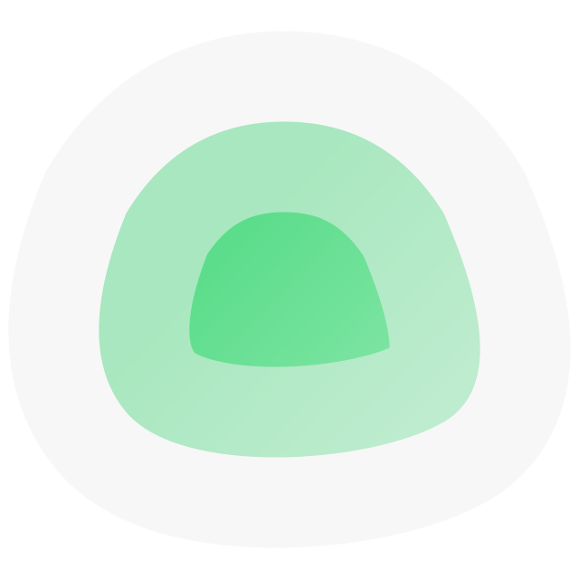

<div align="center" width="100%">
    
</div>

# Uptime Kuma + мультипользователи

**Языки:** [English](README.en.md) | Русский

Форк [louislam/uptime-kuma](https://github.com/louislam/uptime-kuma) с добавлением ролей (admin / user), избирательного шаринга мониторов и защиты страниц статуса.

---

Uptime Kuma — удобный self-hosted инструмент мониторинга.


## ⭐ Возможности

- Мониторинг HTTP(s) / TCP / Keyword / Json Query / WebSocket / Ping / DNS / Push / Steam Game Server / Docker
- Быстрый и отзывчивый интерфейс на Vue 3
- Уведомления через Telegram, Discord, Gotify, Slack, Pushover, Email (SMTP) и 90+ сервисов
- Интервал проверки от 20 секунд
- Мультиязычность
- Несколько страниц статуса
- Привязка страниц статуса к доменам
- Графики пинга
- Информация о TLS-сертификате
- Поддержка прокси
- Двухфакторная аутентификация (2FA)
- **Мультипользовательский режим** — роли admin и user, избирательный шаринг мониторов
- **Защита страниц статуса** — публичная, по паролю или только для авторизованных пользователей

## 👥 Мультипользовательский режим

| Возможность | Admin | User |
|---|:---:|:---:|
| Просматривать свои мониторы | ✅ | ✅ |
| Просматривать расшаренные мониторы | ✅ | ✅ |
| Создавать мониторы | ✅ | ✅ |
| Редактировать / удалять свои мониторы | ✅ | ✅ |
| Шарить монитор конкретным пользователям | ✅ | ❌ |
| Добавлять / удалять пользователей | ✅ | ❌ |

**Как это работает:**
1. Первый аккаунт, созданный при начальной настройке, автоматически становится **Admin**.
2. Admin добавляет пользователей через **Настройки → Пользователи**.
3. При создании или редактировании монитора у Admin появляется секция **«Доступ»** — выбор пользователей, которым монитор будет виден.
4. Пользователи с доступом видят монитор, но не могут его редактировать.
5. Если монитор находится в группе — группа тоже расшаривается автоматически.

## 🔒 Защита страниц статуса

Для каждой страницы статуса можно выбрать один из трёх режимов доступа:

| Режим | Описание |
|---|---|
| **Публичная** | Открыта для всех без авторизации |
| **По паролю** | Показывает форму ввода пароля перед просмотром |
| **Только для пользователей** | Требует вход под логином/паролем из системы пользователей |

Режим задаётся в настройках страницы статуса (поле **Access**). Токен авторизации сохраняется в сессии браузера.

> Режим «Только для пользователей» удобен для создания внутренней панели мониторинга: достаточно создать обычного пользователя и дать ему ссылку на страницу статуса — он войдёт своим логином/паролем и увидит только нужные мониторы.

## 🔧 Установка

### 🐳 Docker + Caddy — рекомендуется (автоматический HTTPS)

Папка [`docker-deploy/`](docker-deploy/) содержит всё необходимое:

```
docker-deploy/
├── docker-compose.yaml   # Caddy + Uptime Kuma
├── Dockerfile            # сборка приложения из исходников (фронт + бэк)
└── Caddyfile.example     # скопируй в Caddyfile и укажи домен
```

**Шаги:**

```bash
# 1. Клонируй репозиторий
git clone https://github.com/drno88/uptime-kuma-fork.git
cd uptime-kuma-fork/docker-deploy

# 2. Создай Caddyfile из шаблона и укажи домен
cp Caddyfile.example Caddyfile
nano Caddyfile

# 3. Собери и запусти
docker compose up -d --build
```

Что происходит при `--build`:
- Docker устанавливает зависимости Node.js
- Собирает Vue-фронтенд (`npm run build`)
- Запускает Uptime Kuma + Caddy в одной сети
- Caddy автоматически получает TLS-сертификат

Порт 3001 **не открывается** во внешнюю сеть — весь трафик идёт через Caddy.

> [!WARNING]
> Файловые системы **NFS** не поддерживаются. Используй локальный каталог или Docker volume.

### 💪 Без Docker

Требования:
- Linux (Debian, Ubuntu, Fedora, Arch и др.) или Windows 10 x64 / Server 2012 R2+
- [Node.js](https://nodejs.org/en/download/) >= 20.4
- [Git](https://git-scm.com/downloads)
- [pm2](https://pm2.keymetrics.io/) — для работы в фоне

```bash
git clone https://github.com/drno88/uptime-kuma-fork.git
cd uptime-kuma-fork
npm run setup

# Вариант 1. Запустить напрямую
node server/server.js

# Вариант 2. Запустить в фоне через PM2 (рекомендуется)
npm install pm2 -g && pm2 install pm2-logrotate
pm2 start server/server.js --name uptime-kuma

# Добавить в автозапуск
pm2 startup && pm2 save
```

## 🆙 Обновление

```bash
cd uptime-kuma-fork
git pull
cd docker-deploy
docker compose up -d --build
```

## 🖼 Скриншоты

Светлая тема:


Страница статуса:


Настройки:


---

Основан на [louislam/uptime-kuma](https://github.com/louislam/uptime-kuma).
